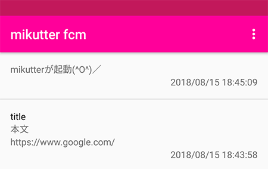

# mikutter_fcm_for_android
[](#)
[](#)
[](#)
[](#)
[](#)

## これなん
Firebase Cloud Messagingで通知を受け取ります．  
mikutterに以下のプラグインを入れてイベントを呼び出すと通知が投げられます．  
[mikutter_fcm](https://github.com/yuzumone/mikutter_fcm)

## スクショ


## ダウンロード
[APK](https://github.com/yuzumone/mikutter_fcm_for_android/releases/download/v1.1.2/app-release.apk)

## ライブラリ
- Android Support Library
- Kotlin Standard Library
- [Android Architecture Components](https://developer.android.com/topic/libraries/architecture/)
- [Firebase](https://firebase.google.com/)
- [Crashlytics](http://try.crashlytics.com/)
- [Dagger](https://google.github.io/dagger/)

## Licenses
```
Copyright 2018 yuzumone

Licensed under the Apache License, Version 2.0 (the "License");
you may not use this file except in compliance with the License.
You may obtain a copy of the License at

    http://www.apache.org/licenses/LICENSE-2.0

Unless required by applicable law or agreed to in writing, software
distributed under the License is distributed on an "AS IS" BASIS,
WITHOUT WARRANTIES OR CONDITIONS OF ANY KIND, either express or implied.
See the License for the specific language governing permissions and
limitations under the License.
```
